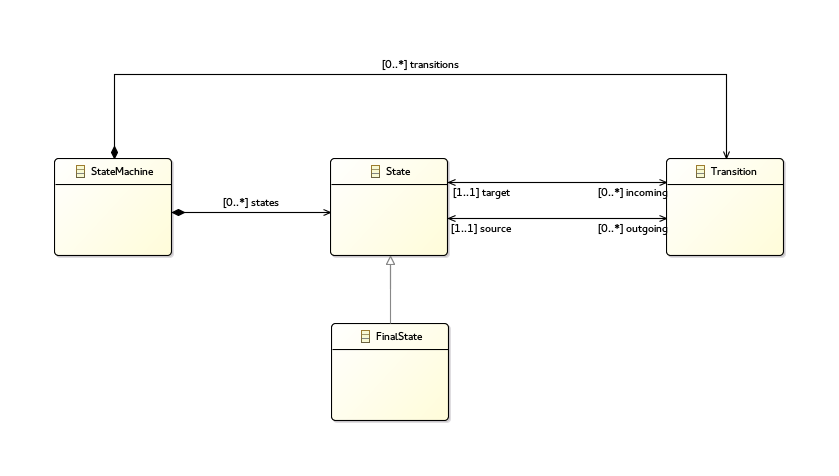



In this tutorial you will learn how to write a generic tool working for a family of languages

### Generic algorithm

We will write an algorithm able to check that all States lead to a FinalState. And we want that check for all FSM expressed in any the 4 FSM languages.

#### Interface of language : the Model Type

Before writing the check algorithm, we need to define on what we will work. Like you probably do every days when programming, we will define an interface.
We call this interface "Model Type", that is a structural description of language.

Our algorithm will work on StateMachine, Transition, State and FinalState. We describe these elements an their relations in an Ecore file.

We use the keyword **modeltype** to declare it in the .melange file.

~~~
modeltype FsmInterface{
	ecore "platform:/resource/org.sample.fsmmodeltype/model/modeltype.ecore"
}
~~~

#### Transformation

We use the keyword **transformation** to declare operations in the .melange file.

~~~
transformation check(FsmInteraface fsm){
	//TODO: spanning tree -> deep first exploration
}
~~~

As you can this the only elements used are State, FinalState, Transition and StateMachine. All languages typed by FsmInteraface will be allowed as input of check().

#### Test it!

~~~
@Main
transformation main() {
	val fsm1 = SimpleFSM.load("input/Simple.xmi")
	val fsm2 = TimedFSM.load("input/Timed.xmi")
	val fsm3 = CompositeFSM.load("input/Composite.xmi")
	val fsm4 = TimedCompositeFSM.load("input/TimedComposite.xmi")
	
	check.call(fsm1)
	check.call(fsm2)
	check.call(fsm3)
	check.call(fsm4)
}
~~~

Here we have:

 * \<languageName>.load(\<file.xmi\>) 
   To load a model
 * \<transformationName\>.call(\<parameters...\>) 
   To call a transformation

Congratulation, you wrote an algorithm working on different languages !
