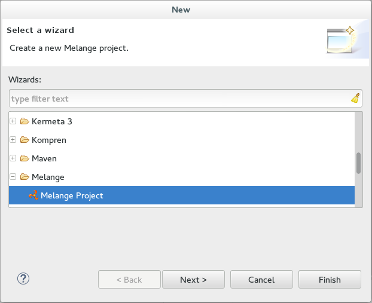
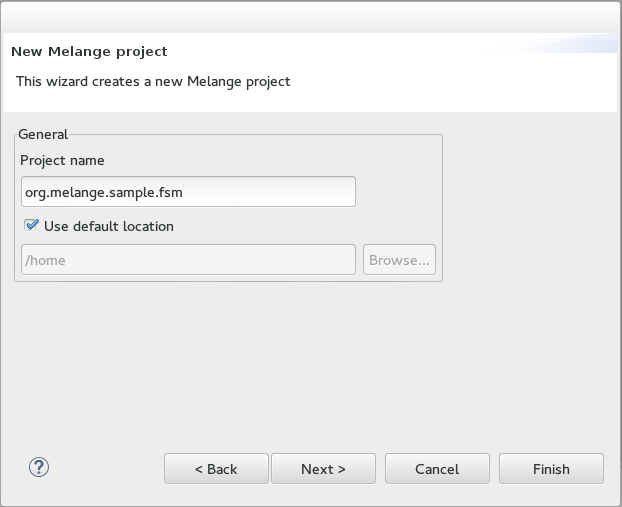
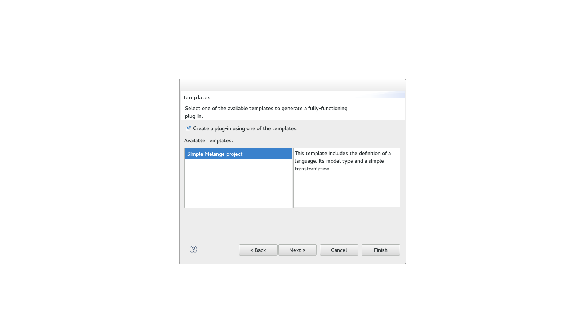
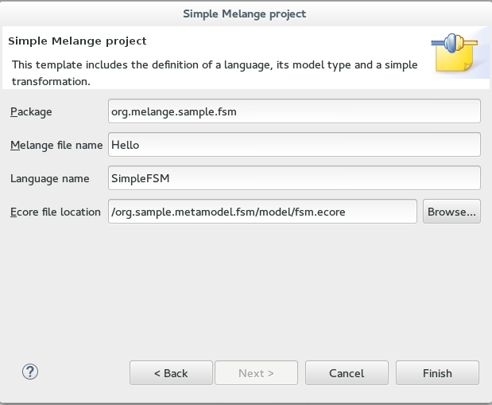



In this tutorial we will define a simple language able to describe Finite State Machines. Through this example you will learn how to make an executable language with Melange.

### Designing languages

#### What is a Finite State Machine

>It is conceived as an abstract machine that can be in one of a finite number of states. The machine is in only one state at a time; the state it is in at any given time is called the current state. It can change from one state to another when initiated by a triggering event or condition; this is called a transition. A particular FSM is defined by a list of its states, and the triggering condition for each transition.
>
>

[From Wikipedia](http://en.wikipedia.org/wiki/Finite-state_machine)

If we do a list of elements for our language we have:

 - A State Machine
 - Some States
 - An Initial State (it's the entry point of the State Machine)
 - A Final State (we need also an exit point)
 - Some Transitions

Each point of this list will be an element in the model representing our language.

#### Modeling

Melange is based on the Eclipse Modeling Framework to defining languages.
EMF provide editors creating models that we will use to define our Simple FSM language.

Define the model:

 1. Go in `File > New > Project...` and select `Eclipse Modeling Framework > Empty EMF Project`, then click `Next` 
    Name your project "org.sample.metamodel.fsm", then `Finish`.
 2. Right click on the 'model' folder and go in `New > Others ...` 
    Select `Eclipse Modeling Framework > Ecore model`, then `Next` 
    Name it "fsm.ecore" and click `Finish`
 3. In the opened .ecore you have a root package with no name. 
    Open the Properties view (Menu `Show View > Other... > General > Properties`) 
    Set "finitestatemachine" for name, "finitestatemachine" for Ns prefix and "org.sample.fsm" for Ns URI.
 4. For each elements of our language add an EClass in the root package with a right click and `New Child > EClass` 
    You can edit the EClass name in the Propeties view.
 5. Right click on the Transition then `New Child > EAttribute` 
    In the Properties view name it 'event' and set EType to EString. 
 6. To link elements to each other you can add EReference with the right click on EClass. 
    In the Properties view name and set EType to the targeted EClass. You can also change lower/upper bound and the containment properties if needed.

Generate the Java code:

  1. Right clic on the model folder, `New > Other...` and select `Eclipse Modeling Framework > EMF Generator Model`, then `Next`
  2. Name it "fsm.genmodel" and put it in model folder, then `Next`.
  3. Select Ecore model, then `Next`
  4. `Browse Workspace` and select fsm.ecore, then `Next`
  5. Their is only one package so clic `Finish`.
  6. Open fsm.genmodel, do a right clic on the root and select `Generate Model Code`. It will make Java classes from your .ecore.

#### Adding behavior

In this section we will use Kermeta 3 to add behavior on our model.

 1. Go in `File > New > Project...` and select `Kermeta 3 > K3 Project`
    Name your project "org.sample.simplefsm.aspect" and click on `Finish`
 2. Open the `META-INF/MANIFEST.MF` and in the `dependencies` tab add Plug-ins
    - org.sample.simplefsm
    - org.sample.timedfsm
    - org.sample.compositefsm
    - org.sample.timedcompositefsm
 3. Change the name of the "sample" package for "org.sample.simplefsm" (right click `Refactor > Rename...`)
 4. Create a new file "Aspects.xtend" in this package (right click `New > File`) and open it.
 5. Declare the containing package and import the annotation from Kermeta 3 that we will use to define aspect.
    
    ~~~xtend
    package org.sample.simplefsm;
    
    import fr.inria.diverse.k3.al.annotationprocessor.Aspect
    ~~~
    
 6. We want to define behavior on elements of our model. Kermeta 3 allows us to add new properties and
    operations in existing classes without extending them.
    All we just need to do is writing a new class and using the K3's annotation to weave it on the base class.

For example for the Transition:

~~~xtend
@Aspect(className=Transition)
class TransitionAspect {
	
	def public void fire(){
		
		val fsm = _self.stateMachine

		val target = _self.target
		_self.stateMachine.currentState = target

		println("fire : " + _self.event)
	}
}
~~~

With the **@Aspect** we re-open the class "Transition" to add a method fire() implementing its behavior.

The attribute 'currentState' doesn't exist in StateMachine but we can add it by aspect:

~~~xtend
@Aspect(className=StateMachine)
	class StateMachineAspect {
		State currentState

		def void init(){
			currentState = _self.states.findFirst[InitialState]
		}

      def void eval(List<String> event){
			init()
			event.forEach[ event |
				val transition = currentState.getActiveTransition(event)
				transition?.fire()
			]
      }
	}
}
~~~

And of course State need getActiveTransition(String):

~~~xtend
@Aspect(className=State)
class StateAspect {
	def public Transition getActiveTransitions(String event){
		_self.outgoing?.forEach[ transition |
			if(transition.event == event) return transition
		]
		return null
	}
}
~~~

Then you need some imports at the begin of Aspect.xtend to enable the call of aspect's methods for base classes

~~~xtend
import static extension finitestatemachines.StateAspect.*
import static extension finitestatemachines.StateMachineAspect.*
import static extension finitestatemachines.TransitionAspect.*
~~~

For more details, have a look at the Kermeta 3 documentation : [Defining aspects](https://github.com/diverse-project/k3/wiki/Defining-aspects-in-Kermeta-3)

### The Melange world

#### New project

To create a Melange project using your family of language:

 1. Go in the menu `File > New > Project...` and select `Melange > Melange Project`, then clic `Next`.
    
    
 2. Put "org.melange.fsm" in Project name and clic `Next`.
    
    
 3. Check `Create a plug-in using one of the templates` and select `Simple Melange project`, then `Next`.
    
    
 4. Set "org.sample.fsm" as package, and change language name to SimpleFSM. Browse the location to select fsm.ecore from the Simple FSM project, then `Finish`.
    
    
 5. Open the `META-INF/MANIFEST.MF` and in the `dependencies` tab add Plug-ins
    - org.sample.timedfsm
    - org.sample.compositefsm
    - org.sample.timedcompositefsm
    org.sample.simplefsm should be already there thanks to the wizard.
 6. In the .melange file, copy-paste the `language SimpleFSM{...}` for other languages (and adapt them).

You should have these declarations in the .melange file:

~~~
language SimpleFSM {
	ecore "platform:/resource/org.sample.fsm/model/fsm.ecore"
	exactType SimpleFSMMT
}
~~~

If you look at the outline at the right side, you can see the list of languages, each one typed by their own 'exactType' and by matching other language type.

Each language is defined by an .ecore file but remember we added behaviors with aspects. So we have to put them also in the languages declaration.

~~~
language SimpleFSM {
	ecore "platform:/resource/org.sample.fsm/model/fsm.ecore"
	with finitestatemachines.StateMachineAspect
	with finitestatemachines.StateAspect
	with finitestatemachines.TransitionAspect
	exactType SimpleFSMMT
}
~~~

As you see the keyword **with** refer to the class with the **@Aspect**

#### Test it!

Congratulation, you defined your first executable language in Melange! Now we will test if it works fine.
To do so, we will declare a **transformation** that will load a SimpleFSM an execute it.

~~~
@Main
transformation main() {
	val events = newArrayList('x', 'y', 'o', 'p', 'q')
	
	val model = SimpleFSM.load("input/Simple.xmi")
 	val fsm = model.contents.head as finitestatemachines.simplefsmmt.StateMachine

	fsm.init()
	fsm.eval(events)
}
~~~

Here we have:

 * SimpleFSM.**load(**\<file.xmi\>**)** 
   To load a model conform to SimpleFSM
 * **@Main** 
   In Melange we can declare several **transformations**. To set one of them the entry point we tag it with **@Main**.
 * model.**contents.head** as finitestatemachines.simplefsmmt.StateMachine  
   We get the first element of the model and cast it to the right type.  
   *finitestatemachines.simplefsmmt* is the package containning all classes of the **exactType** of the SimpleFSM language.

To launch the **main()**, look inside the folder `src-gen` (where Melange generates Java files) and inside the package *finitestatemachines*, right clic on **Main.java** and select `Run As > Java Application`.

### Conclusion

In this tutorial you learnt how to design a language with Ecore, add a behavior on top of this structural description and use Melange to merge all together.
