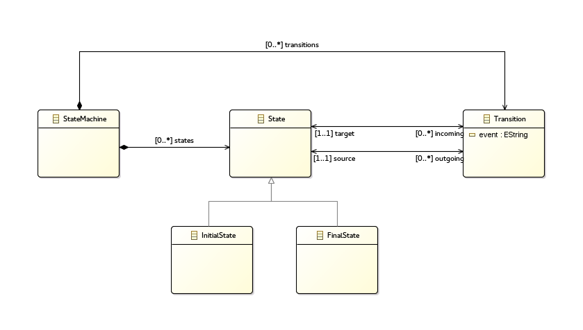
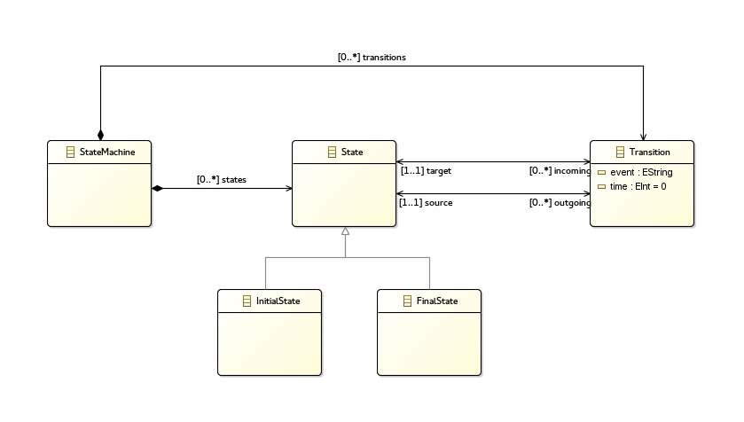
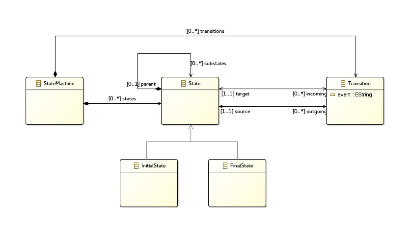
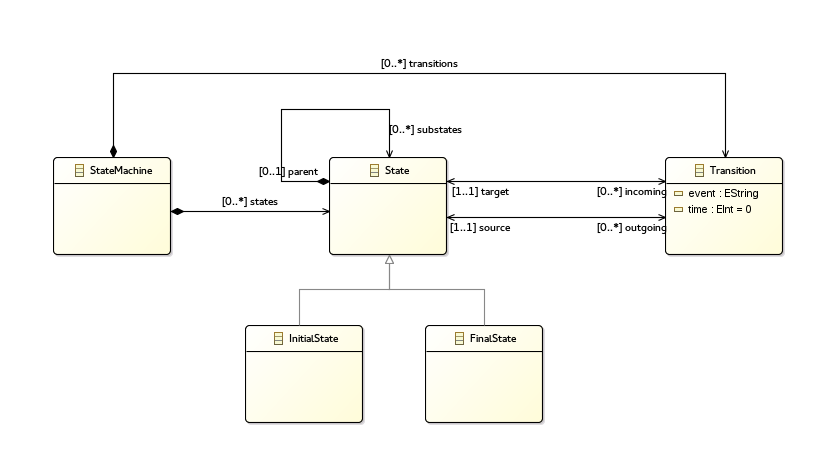



# Melange tutorial

In this tutorial you will learn how to make executable languages and how Melange can help you to write generic algorithms for a familly of language thanks to Model Type.

We will first design 4 differents languages close enough that we would write one tool for all of them, and then will do it !

## Variants of language

Melange is a tool to manipulate languages and we will explore its possibilities. But first we need a familly of languages.

In this chapter we will create four differents languages which are variations of Finite State Machine language.

### What is a Finite State Machine

>It is conceived as an abstract machine that can be in one of a finite number of states. The machine is in only one state at a time; the state it is in at any given time is called the current state. It can change from one state to another when initiated by a triggering event or condition; this is called a transition. A particular FSM is defined by a list of its states, and the triggering condition for each transition.
>
>

[From Wikipedia](http://en.wikipedia.org/wiki/Finite-state_machine)

#### Targeted FSM languages

The variations of FSM language we will design are:

 * Simple FSM 
   This language is the most basic. It is able to define FSM with States and Transition handling Event.
 * Timed FSM 
   This language is the same as Simple FSM except you can add time on Transition.
 * Composite FSM 
   This language is the same as Simple FSM except State can contains sub States.
 * Timed composite FSM 
   This language as its name suggest, have both composite States and time on Transitions.

### Designing languages

#### Simple FSM

If we do a list of elements for our language we have:

 - A State Machine
 - Some States
 - An Initial State (it's the entry point of the State Machine)
 - A Final State (we need also an exit point)
 - Some Transitions

Each point of this list will be an element in the model representing our language.

##### Modeling

Melange is based on the Eclipse Modeling Framework to defining languages.
EMF provide editors creating models that we will use to define our Simple FSM language.

Define the model:

 1. Go in `File > New > Project...` and select `Eclipse Modeling Framework > Empty EMF Project`, then click `Next` 
    Name your project "org.sample.metamodel.fsm", then `Finish`.
 2. Right click on the 'model' folder and go in `New > Others ...` 
    Select `Eclipse Modeling Framework > Ecore model`, then `Next` 
    Name it "fsm.ecore" and click `Finish`
 3. In the opened .ecore you have a root package with no name. 
    Open the Properties view (Menu `Show View > Other... > General > Properties`) 
    Set "finitestatemachine" for name, "finitestatemachine" for Ns prefix and "org.sample.fsm" for Ns URI.
 4. For each elements of our language add an EClass in the root package with a right click and `New Child > EClass` 
    You can edit the EClass name in the Propeties view.
 5. Right click on the Transition then `New Child > EAttribute` 
    In the Properties view name it 'event' and set EType to EString. 
 6. To link elements to each other you can add EReference with the right click on EClass. 
    In the Properties view name and set EType to the targeted EClass. You can also change lower/upper bound and the containment properties if needed.

Generate the Java code:

  1. Right clic on the model folder, `New > Other...` and select `Eclipse Modeling Framework > EMF Generator Model`, then `Next`
  2. Name it "fsm.genmodel" and put it in model folder, then `Next`.
  3. Select Ecore model, then `Next`
  4. `Browse Workspace` and select fsm.ecore, then `Next`
  5. Their is only one package so clic `Finish`.
  6. Open fsm.genmodel, do a right clic on the root and select `Generate Model Code`. It will make Java classes from your .ecore.

##### Weaving aspects

In this section we will use Kermeta 3 to add behavior on our model.

 1. Go in `File > New > Project...` and select `Kermeta 3 > K3 Project`
    Name your project "org.sample.simplefsm.aspect" and click on `Finish`
 2. Open the `META-INF/MANIFEST.MF` and in the `dependencies` tab add Plug-ins
    - org.sample.simplefsm
    - org.sample.timedfsm
    - org.sample.compositefsm
    - org.sample.timedcompositefsm
 3. Change the name of the "sample" package for "org.sample.simplefsm" (right click `Refactor > Rename...`)
 4. Create a new file "Aspects.xtend" in this package (right click `New > File`) and open it.
 5. Declare the containing package and import the annotation from Kermeta 3 that we will use to define aspect. 
    ~~~xtend
    package org.sample.simplefsm;
    
    import fr.inria.diverse.k3.al.annotationprocessor.Aspect
    ~~~
 6. We want to define behavior on elements of our model. Kermeta 3 allows us to add new properties and
    operations in existing classes without extending them.
    All we just need to do is writing a new class and using the K3's annotation to weave it on the base class.

For example for the Transition:

~~~xtend
@Aspect(className=Transition)
class TransitionAspect {
	
	def public void fire(){
		
		val fsm = _self.stateMachine

		val target = _self.target
		_self.stateMachine.currentState = target

		println("fire : " + _self.event)
	}
}
~~~

With the **@Aspect** we re-open the class "Transition" to add a method fire() implementing its behavior.

The attribute 'currentState' does'nt exist in StateMachine but we can add it by aspect:

~~~xtend
@Aspect(className=StateMachine)
	class StateMachineAspect {
		State currentState

		def void init(){
			currentState = _self.states.findFirst[InitialState]
		}

      def void eval(List<String> event){
			init()
			event.forEach[ event |
				val transition = currentState.getActiveTransition(event)
				transition?.fire()
			]
      }
	}
}
~~~

And of course State need getActiveTransition(String):

~~~xtend
@Aspect(className=StateMachine)
class StateMachineAspect {
	def public Transition getActiveTransitions(String event){
		_self.outgoing?.forEach[ transition |
			if(transition.event == event) return transition
		]
		return null
	}
}
~~~

For more details, have a look at the Kermeta 3 documentation : [Defining aspects](https://github.com/diverse-project/k3/wiki/Defining-aspects-in-Kermeta-3)

#### Others FSM

For other variantes of FSM language process in the same way as for the Simple FSM project.

##### Timed FSM

We add an EAttribut **time : EInt** in Transition

##### Composite FSM

We add a containment EReference **substates : State** in State

##### Timed composite

We add same changes as Timed and Composite FSM

## The Melange world

### New project

### Interface of language : the Model Type

### Transformation?

## Conclusion

In this tutorial you learnt how to add behavior on a language and used Melange to write a generic algorithm for different (but close) languages.
